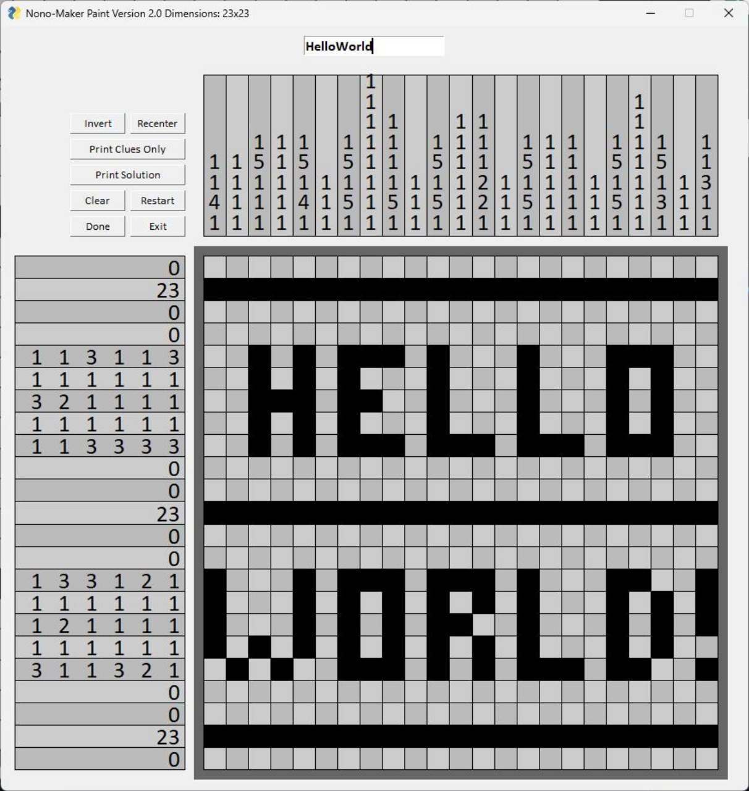

# nonomaker
uses Python and pysimplegui

GUI to make a nonogram

https://en.wikipedia.org/wiki/Nonogram

can: pick canvas size, blocksize, max waiting time for solving; draw a nonogram, check if it's solvable, and export as either the solution (screenshot below) or the blank version (so the clues with a blank canvas)

to do: some QoL stuff (other themes, icons for the buttons)

Sample (the new version has a new button layout):

