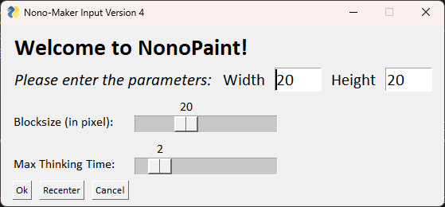
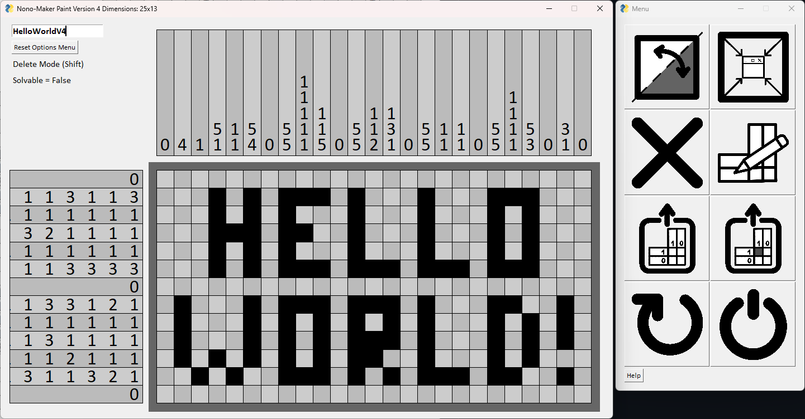
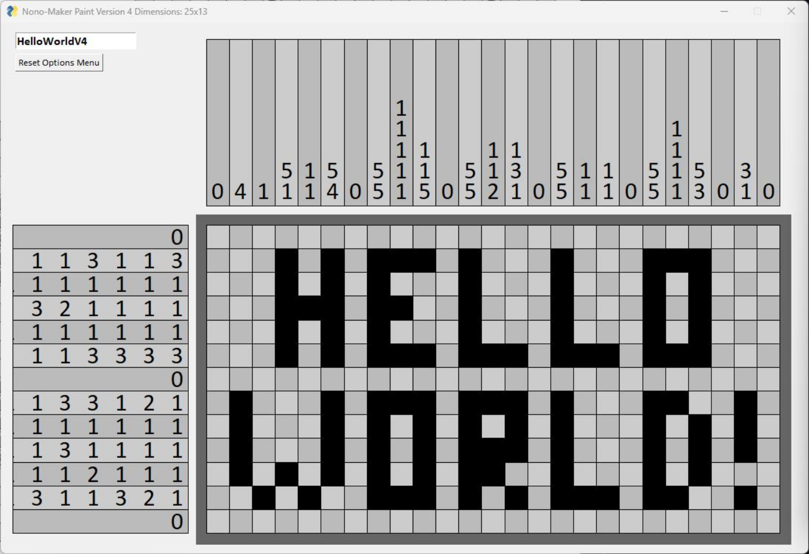

# nonomaker
uses Python and pysimplegui (and some other things specifically for the imported solver) 

GUI to make a nonogram

https://en.wikipedia.org/wiki/Nonogram

can: pick canvas size, blocksize, max waiting time for solving; draw a nonogram, check if it's solvable, and export as either the solution or the blank version (so the clues with a blank canvas)

All necessary functions are in the main file, no need to download the rest. EXCEPT for the .png files, the current version requires them (I made those too). The "NonoClueGenerator" DOES still work as a standalone (using .txt files for instance), but requires some cleanup - it prints the clues with the nonogram itself in the terminal.

to do: some QoL stuff like a version that doesn't require the icons, but uses alt-text; different themes

Samples:

First Window: 

Main Window + Buttons: 

"Export with Solution" Option:

