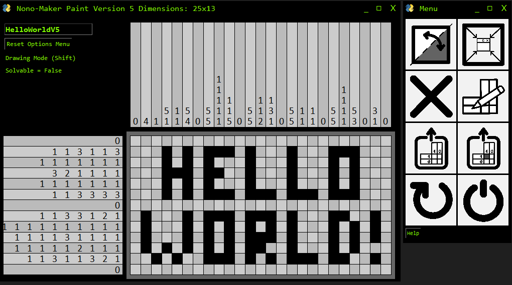
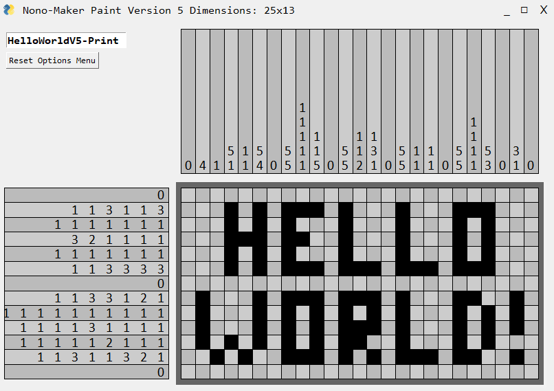

# nonomaker
uses Python and pysimplegui (and some other things specifically for the imported solver) - solver from https://gist.github.com/henniedeharder/d7af7462be3eed96e4a997498d6f9722#file-nonogramsolver-py 

GUI to make a nonogram

https://en.wikipedia.org/wiki/Nonogram

can: pick canvas size, blocksize, max waiting time for solving, cluefield size, theme ("hackerview" and "printview"); draw a nonogram, check if it's solvable, and export as either the solution or the blank version (so the clues with a blank canvas)

All necessary functions are in the main file, no need to download the rest. I do suggest downloading the "Icon___.png" files because the alt version is less pretty. The "NonoClueGenerator" DOES still work as a standalone (using .txt files for instance), but requires some cleanup - it prints the clues with the nonogram itself in the terminal.

To Do: A color and web version, maybe.

Samples:

First Window: 

Main Window + Buttons ("Hackerview","Printview"): 

Main Window + Buttons (Alt-Text) ("Hackerview","Printview"): 

"Export with Solution" Option:

